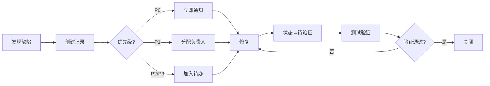

# 缺陷管理 - 飞书表格设置指南

> **用途：** 使用飞书表格管理项目缺陷  
> **位置：** 建议在飞书云文档中创建

---

## 📊 飞书表格结构

### 主表：缺陷跟踪表

| 列名 | 类型 | 说明 | 示例 |
|------|------|------|------|
| **缺陷ID** | 文本 | 自动编号 BUG-001, BUG-002... | BUG-001 |
| **标题** | 文本 | 简短描述问题 | 火焰弹伤害计算错误 |
| **优先级** | 单选 | P0/P1/P2/P3 | P1 |
| **状态** | 单选 | 待处理/处理中/已修复/待验证/已关闭/重新打开 | 处理中 |
| **发现时间** | 日期 | 自动填充 | 2026-03-19 |
| **发现人** | 成员 | @提及 | @测试 |
| **负责人** | 成员 | @提及 | @核心程序员 |
| **所属模块** | 单选 | 战斗系统/融合系统/存档系统/... | 战斗系统 |
| **发现版本** | 文本 | Week 几 或 v0.x.x | Week 2 |
| **复现概率** | 单选 | 100%/偶现/罕见 | 100% |
| **详细描述** | 长文本 | 复现步骤 + 期望/实际结果 | 见下方模板 |
| **附件** | 附件 | 截图/日志/视频 | - |
| **修复时间** | 日期 | 修复完成日期 | 2026-03-20 |
| **验证时间** | 日期 | 测试验证日期 | 2026-03-21 |
| **关闭原因** | 单选 | 已修复/重复/不是缺陷/不修复 | 已修复 |

---

## 📝 详细描述模板

**在"详细描述"列使用以下格式：**

```markdown
## 复现步骤
1. 进入战斗
2. 打出火焰弹（ATK_001）对敌人使用
3. 观察敌人血量

## 期望结果
敌人应该减少 8 点 HP

## 实际结果
敌人减少了 16 点 HP（伤害翻倍）

## 环境信息
- Unity版本：2022.3.15
- 平台：Windows 11
- 构建版本：Week 2 Debug

## 补充说明
只有火焰弹有此问题，其他卡牌正常
```

---

## 🎨 飞书表格视图配置

### 视图1：待处理缺陷（默认）
**筛选条件：**
- 状态 = 待处理 或 处理中 或 待验证
- 按优先级降序排列（P0 → P1 → P2 → P3）
- 按发现时间升序（先发现的先处理）

### 视图2：本周新增
**筛选条件：**
- 发现时间 = 最近 7 天
- 按优先级降序

### 视图3：P0/P1 紧急缺陷
**筛选条件：**
- 优先级 = P0 或 P1
- 状态 ≠ 已关闭
- 高亮显示

### 视图4：我负责的缺陷
**筛选条件：**
- 负责人 = @我
- 状态 ≠ 已关闭

### 视图5：已修复待验证
**筛选条件：**
- 状态 = 待验证
- 按修复时间升序

---

## 📈 统计看板（使用飞书表格数据透视）

### 统计1：缺陷优先级分布
- 维度：优先级
- 数值：计数

### 统计2：缺陷状态分布
- 维度：状态
- 数值：计数

### 统计3：每周新增/修复趋势
- 维度：发现时间（按周分组）
- 数值：计数

### 统计4：模块缺陷分布
- 维度：所属模块
- 数值：计数
- 用途：识别高风险模块

---

## 🔔 通知规则（飞书表格自动化）

### 自动化1：P0 缺陷通知
**触发条件：** 新增记录 且 优先级 = P0  
**动作：** 在飞书群发送通知 + @全体成员

### 自动化2：超期未修复提醒
**触发条件：** 
- P0 缺陷发现超过 24 小时未修复
- P1 缺陷发现超过 3 天未修复

**动作：** 飞书群通知 + @负责人

### 自动化3：待验证提醒
**触发条件：** 状态 = 待验证 且 超过 1 天未验证  
**动作：** 飞书群通知 + @测试负责人

---

## 🎯 缺陷处理流程



---

## 📋 每周缺陷报告模板

**在飞书文档中记录，每周五生成：**

```markdown
# Week X 缺陷报告（YYYY-MM-DD）

## 📊 本周缺陷统计
- 新增：XX 个（P0:X, P1:X, P2:X, P3:X）
- 修复：XX 个
- 待修复：XX 个（P0:X, P1:X, P2:X, P3:X）

## 🔥 P0/P1 缺陷状态
| 缺陷ID | 标题 | 负责人 | 状态 | 备注 |
|--------|------|--------|------|------|
| BUG-001 | ... | @XXX | 处理中 | 预计周一修复 |
| BUG-005 | ... | @XXX | 待验证 | 已修复待测试 |

## ⚠️ 风险提示
- 【高风险】BUG-001 涉及存档系统，影响较大
- 【超期】BUG-003 已超期 2 天未修复

## 📈 趋势分析
- 本周新增缺陷较上周增加/减少 XX%
- 战斗系统缺陷占比 XX%（需重点关注）

## 🎯 下周计划
- 完成所有 P0/P1 缺陷修复
- 进行 Week X 验收测试
```

---

## 🛠️ 快速操作指南

### 新增缺陷（2分钟）
1. 打开飞书表格
2. 点击"新增记录"
3. 填写：缺陷ID（自动）、标题、优先级、所属模块、详细描述
4. @分配负责人
5. 保存

### 修复缺陷（1分钟）
1. 找到对应缺陷记录
2. 状态改为"已修复"
3. 填写"修复时间"
4. 在备注中说明修复方案
5. @测试人员验证

### 关闭缺陷（30秒）
1. 测试验证通过
2. 状态改为"已关闭"
3. 填写"验证时间"
4. 选择"关闭原因"

---

## 📎 飞书表格模板下载

**创建步骤：**
1. 在飞书云文档中创建"多维表格"
2. 参考上方"主表结构"添加列
3. 配置单选/多选/成员字段
4. 创建视图（待处理缺陷/本周新增/P0P1紧急/...）
5. 设置自动化通知规则
6. 分享给团队成员（编辑权限）

**表格链接：** [待创建]

---

## 🎓 使用培训

**团队成员必读：**
1. 发现 bug 必须录入表格（不能只口头说）
2. 修复后必须改状态（不能改完就忘）
3. P0/P1 缺陷必须当天响应
4. 每周五下午 16:00 缺陷评审会（检查待修复缺陷）

---

## 📞 联系人

**表格管理员：** @项目经理  
**技术咨询：** @测试负责人  
**权限问题：** @项目经理

---

**文档版本历史：**
- v1.0 (2026-03-19) - 初始版本，飞书表格缺陷管理方案
