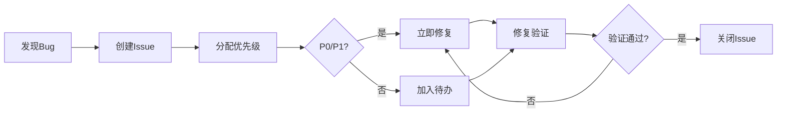

# 测试策略文档 (Test Strategy)

> **版本：** 1.0  
> **最后更新：** 2026-03-19  
> **负责人：** 测试架构师

---

## 📋 目录

- [1. 测试目标](#1-测试目标)
- [2. 测试层级](#2-测试层级)
- [3. 测试类型](#3-测试类型)
- [4. 验收标准](#4-验收标准)
- [5. 测试工具](#5-测试工具)
- [6. 测试排期](#6-测试排期)
- [7. 缺陷管理](#7-缺陷管理)

---

## 1. 测试目标

### 1.1 质量目标

| 维度 | 目标 | 衡量标准 |
|------|------|---------|
| **功能正确性** | 核心功能零缺陷 | Week 12 前无 P0/P1 缺陷 |
| **性能稳定性** | 流畅游戏体验 | 战斗帧率 ≥30FPS，加载时间 <3秒 |
| **数值平衡性** | 核心玩法可玩 | 测试玩家胜率 40%-60% |
| **兼容性** | 主流配置可玩 | Windows 10/11 + Steam Deck |
| **用户体验** | 易学易上手 | 新玩家 5 分钟内理解核心玩法 |

### 1.2 风险控制目标

- **阻止高风险缺陷进入生产环境**（如存档损坏、战斗死锁）
- **提前发现性能瓶颈**（避免 Week 11 才发现卡顿）
- **确保数值平衡可调**（避免某张卡过强导致游戏失衡）

---

## 2. 测试层级

遵循**测试金字塔**原则：大量单元测试 + 适量集成测试 + 少量 E2E 测试

```
       /\
      /  \     E2E 测试（10%）
     /____\    - 完整游戏流程
    /      \   集成测试（30%）
   /________\  - 模块间交互
  /          \ 单元测试（60%）
 /____________\- 独立函数/类
```

### 2.1 单元测试（Unit Test）

**目标：** 验证独立函数/类的逻辑正确性

**覆盖范围：**
- ✅ 卡牌效果计算逻辑
- ✅ 融合算法（输入2张卡 → 输出新卡）
- ✅ 伤害/护盾/治疗计算
- ✅ 状态效果叠加/消除逻辑
- ✅ 敌人行为决策逻辑
- ✅ 数据序列化/反序列化

**测试框架：** NUnit (Unity 内置)

**示例：**
```csharp
[Test]
public void Test_FireBall_Damage_Calculation()
{
    // Given: 火焰弹（8伤害）
    Card fireBall = CardDatabase.GetCard("ATK_001");
    Enemy enemy = new Enemy(50, 0); // 50HP, 0护盾
    
    // When: 对敌人使用
    int damage = BattleCalculator.CalculateDamage(fireBall, enemy);
    
    // Then: 应该造成8点伤害
    Assert.AreEqual(8, damage);
}

[Test]
public void Test_Fusion_FireBall_IceArrow()
{
    // Given: 火焰弹 + 冰霜箭
    Card card1 = CardDatabase.GetCard("ATK_001");
    Card card2 = CardDatabase.GetCard("ATK_006");
    
    // When: 融合
    Card fusedCard = FusionSystem.Fuse(card1, card2);
    
    // Then: 应该产生冰火符文（14伤害+灼烧+冻结）
    Assert.AreEqual("冰火符文", fusedCard.name);
    Assert.AreEqual(14, fusedCard.GetDamage());
    Assert.IsTrue(fusedCard.HasEffect("灼烧"));
    Assert.IsTrue(fusedCard.HasEffect("冻结"));
}
```

**覆盖率目标：**
- 核心逻辑代码：**≥80%**
- 边界情况：**100%**（如 HP=0，能量不足，卡牌库空）

---

### 2.2 集成测试（Integration Test）

**目标：** 验证模块间交互的正确性

**覆盖范围：**
- ✅ 战斗流程：玩家出牌 → 敌人行动 → 回合结算
- ✅ 卡牌管理：抽牌 → 打出 → 弃牌 → 回收
- ✅ 存档系统：保存 → 读取 → 数据完整性
- ✅ UI 与逻辑同步：卡牌拖拽 → 逻辑生效 → UI 更新
- ✅ 事件系统：触发事件 → 多个监听器响应

**测试框架：** NUnit + Unity Test Runner (Play Mode)

**示例：**
```csharp
[UnityTest]
public IEnumerator Test_Battle_Full_Turn()
{
    // Given: 初始化战斗
    BattleManager.StartBattle(new List<Enemy> { TestEnemy.CreateBasic() });
    yield return null; // 等待初始化完成
    
    // When: 玩家打出火焰弹
    Card fireBall = BattleManager.GetHand()[0];
    BattleManager.PlayCard(fireBall, 0); // 对敌人0使用
    yield return new WaitForSeconds(0.5f); // 等待动画
    
    // Then: 敌人应该受到伤害
    Assert.AreEqual(42, BattleManager.GetEnemy(0).currentHP); // 50 - 8 = 42
    
    // When: 结束回合
    BattleManager.EndTurn();
    yield return new WaitForSeconds(1f); // 等待敌人回合
    
    // Then: 玩家应该受到伤害（敌人攻击6）
    Assert.AreEqual(64, BattleManager.GetPlayerHP()); // 70 - 6 = 64
}
```

**覆盖率目标：**
- 关键路径：**100%**（如战斗完整流程）
- 异常路径：**≥60%**（如卡牌库空时抽牌）

---

### 2.3 系统测试（System Test / E2E）

**目标：** 验证完整游戏流程的正确性

**覆盖范围：**
- ✅ 完整关卡通关流程（15层）
- ✅ 难度递增合理性（A0 → A20）
- ✅ 卡牌平衡性验证（统计胜率）
- ✅ 存档/读档后游戏状态一致

**测试方式：** 手动测试 + 自动化回归测试

**测试场景：**
```markdown
### 场景1：新手完整流程
1. 启动游戏 → 新建存档
2. 选择角色（符文法师）
3. 第1层战斗 → 获胜 → 选择奖励（1张卡牌）
4. 第2层战斗 → 使用融合 → 获胜
5. ... 继续到第5层
6. 保存并退出
7. 重新进入 → 读取存档 → 验证数据正确

**验收标准：**
- 战斗无死锁/卡顿
- 融合系统工作正常
- 存档读取后数据无丢失
- 游戏时长：30-40 分钟
```

**覆盖率目标：**
- 核心玩法路径：**100%**
- 边缘场景：**按风险优先级**

---

## 3. 测试类型

### 3.1 功能测试

#### 核心功能清单

| 功能模块 | 测试重点 | 优先级 |
|---------|---------|-------|
| **战斗系统** | 出牌、伤害计算、回合流程 | P0 |
| **融合系统** | 融合算法、预设配方、随机融合 | P0 |
| **卡牌系统** | 抽牌、弃牌、手牌上限、能量消耗 | P0 |
| **敌人AI** | 行为模式、技能释放、血量管理 | P0 |
| **存档系统** | 保存、读取、数据完整性 | P0 |
| **事件系统** | 商店、宝箱、休息点、随机事件 | P1 |
| **关卡生成** | 地图生成、房间类型、路径连通性 | P1 |
| **UI交互** | 卡牌拖拽、按钮点击、信息展示 | P2 |

#### 边界条件测试

**必须覆盖的边界场景：**
- ❌ HP = 0（玩家死亡）
- ❌ HP = 1（濒死状态）
- ❌ 能量 = 0（无法出牌）
- ❌ 手牌 = 0（抽牌堆空）
- ❌ 弃牌堆 = 0（无牌可抽）
- ❌ 敌人 HP = 0（战斗胜利）
- ❌ 融合点 = 0（无法融合）
- ❌ 卡牌库空（无法选择奖励）

---

### 3.2 性能测试

#### 性能基线

| 指标 | 目标 | 测试方法 |
|------|------|---------|
| **战斗帧率** | ≥30 FPS（目标60 FPS）| Unity Profiler |
| **加载时间** | <3 秒（战斗场景）| 手动计时 |
| **内存占用** | <500 MB | Unity Profiler |
| **融合算法** | 1000次融合 <1秒 | 压力测试脚本 |
| **卡牌效果堆叠** | 20个特效同时播放不卡顿 | 极端场景测试 |

#### 压力测试场景

```csharp
[Test]
public void Stress_Test_Fusion_Performance()
{
    // Given: 准备1000对卡牌
    List<(Card, Card)> cardPairs = GenerateRandomCardPairs(1000);
    
    // When: 批量融合
    var stopwatch = System.Diagnostics.Stopwatch.StartNew();
    foreach (var pair in cardPairs)
    {
        FusionSystem.Fuse(pair.Item1, pair.Item2);
    }
    stopwatch.Stop();
    
    // Then: 应该在1秒内完成
    Assert.Less(stopwatch.ElapsedMilliseconds, 1000);
}
```

---

### 3.3 兼容性测试

#### 测试配置

| 平台 | 最低配置 | 推荐配置 | 测试优先级 |
|------|---------|---------|-----------|
| **Windows 10** | i5-6400, 8GB RAM, GTX 750 | i5-10400, 16GB RAM, GTX 1060 | P0 |
| **Windows 11** | 同上 | 同上 | P0 |
| **Steam Deck** | 官方配置 | - | P1 |
| **macOS** | - | - | P2（后期考虑）|

#### 测试内容
- ✅ 不同分辨率下 UI 布局正确（1920x1080, 1280x720, Steam Deck 800x1280）
- ✅ 不同刷新率下游戏流畅（60Hz, 120Hz, 144Hz）
- ✅ 低配置下帧率达标（最低配置 ≥30 FPS）

---

### 3.4 平衡性测试

#### 测试目标
**验证游戏难度合理，核心玩法有趣**

#### 测试方法

**1. 统计胜率（数据驱动）**
```python
# 自动化测试：模拟100局游戏
for i in range(100):
    game = GameSimulator(difficulty=A5)
    result = game.play_full_run()
    win_rate = sum(results) / len(results)

# 验收标准
assert 0.4 <= win_rate <= 0.6  # 胜率 40%-60%
```

**2. 卡牌使用率分析**
```sql
SELECT card_name, COUNT(*) as usage_count
FROM play_logs
GROUP BY card_name
ORDER BY usage_count DESC;

-- 验收标准：
-- - 无卡牌使用率 <1%（说明该卡太弱/无用）
-- - 无卡牌使用率 >50%（说明该卡过强）
```

**3. 玩家反馈收集**
- 邀请 10 名测试玩家
- 每人玩 3 局（约 2 小时）
- 收集反馈问卷：
  - 游戏难度评分（1-10）
  - 融合系统趣味性（1-10）
  - 最喜欢的卡牌（开放题）
  - 最讨厌的卡牌（开放题）

---

## 4. 验收标准

### 4.1 功能验收标准

| 功能 | 验收标准 | 测试方法 |
|------|---------|---------|
| **战斗系统** | 无死锁/无卡顿，10 局无崩溃 | 手动测试 + 自动化测试 |
| **融合系统** | 所有预设配方工作正常，随机融合符合公式 | 单元测试 + 手动验证 |
| **存档系统** | 保存/读取后数据 100% 一致 | 自动化测试（MD5校验）|
| **敌人AI** | 行为符合设计，无明显 bug | 手动测试 + 行为日志 |
| **UI交互** | 所有按钮/拖拽正常响应 | 手动测试 |

### 4.2 性能验收标准

| 指标 | 验收标准 | 不达标处理 |
|------|---------|-----------|
| **战斗帧率** | 平均 ≥60 FPS，最低 ≥30 FPS | 优化特效/算法 |
| **加载时间** | <3 秒 | 异步加载/资源压缩 |
| **内存占用** | <500 MB | 资源卸载/对象池 |
| **融合算法** | 单次 <10ms | 算法优化 |

### 4.3 发布验收标准

**Week 12 发布前必须满足：**
- ✅ 无 P0/P1 缺陷
- ✅ P2 缺陷 ≤5 个
- ✅ 性能指标全部达标
- ✅ 至少 10 名玩家完整测试通过
- ✅ Steam 审核通过（需提前 Week 10 提交 Demo）

---

## 5. 测试工具

### 5.1 自动化测试工具

| 工具 | 用途 | 学习成本 |
|------|------|---------|
| **NUnit** | 单元测试框架 | 低（Unity 内置）|
| **Unity Test Runner** | 集成测试 | 低 |
| **Unity Profiler** | 性能分析 | 中 |
| **Python** | 数据校验脚本 | 低 |

### 5.2 手动测试工具

| 工具 | 用途 | 实现时间 |
|------|------|---------|
| **Debug Console** | 快速测试卡牌效果 | Week 1 |
| **战斗重放系统** | 复现 bug | Week 3 |
| **数据校验工具** | 检查 JSON 配置 | Week 1 |
| **性能监控面板** | 实时显示 FPS/内存 | Week 2 |

### 5.3 数据收集工具

```csharp
// 游戏内埋点：记录关键数据
public class Analytics
{
    public static void LogCardPlayed(Card card, Enemy target)
    {
        var data = new {
            card_id = card.id,
            card_name = card.name,
            turn = BattleManager.CurrentTurn,
            damage = card.GetDamage(),
            target_hp = target.currentHP
        };
        File.AppendAllText("play_log.json", JsonUtility.ToJson(data) + "\n");
    }
}
```

---

## 6. 测试排期

### Week 1-3：原型阶段

| 周次 | 测试重点 | 验收标准 |
|------|---------|---------|
| **Week 1** | 核心框架单元测试 | 管理器基类测试通过 |
| **Week 2** | 战斗系统集成测试 | 简单战斗流程无 bug |
| **Week 3** | **原型验证测试** | 融合系统可玩性验证 |

**Week 3 原型验证清单：**
- [ ] 融合系统是否有趣？（5名玩家，每人30分钟）
- [ ] 战斗节奏是否合适？（单局5-8分钟）
- [ ] 数值平衡是否合理？（10场测试胜率40%-60%）
- [ ] 融合算法性能：1000次融合 <1秒
- [ ] 战斗帧率：≥30 FPS

---

### Week 4-7：内容扩充阶段

| 周次 | 测试重点 | 验收标准 |
|------|---------|---------|
| **Week 4** | 全卡牌功能测试 | 80张卡全部测试通过 |
| **Week 5** | 敌人AI测试 | 18种敌人行为正确 |
| **Week 6** | 融合配方测试 | 50种配方全部验证 |
| **Week 7** | **平衡性测试** | 100局模拟胜率达标 |

**Week 7 平衡性测试重点：**
- 卡牌使用率统计（无卡牌 <1% 或 >50%）
- 敌人难度曲线验证（1-15层递增合理）
- 融合系统平衡性（融合卡不能过强/过弱）

---

### Week 8-10：美术音效阶段

| 周次 | 测试重点 | 验收标准 |
|------|---------|---------|
| **Week 8** | UI适配测试 | 不同分辨率布局正确 |
| **Week 9** | 性能测试 | 所有性能指标达标 |
| **Week 10** | **Steam试审核** | 提交Demo，获取反馈 |

---

### Week 11-12：打磨发布阶段

| 周次 | 测试重点 | 验收标准 |
|------|---------|---------|
| **Week 11** | 完整回归测试 | 核心功能无回归 bug |
| **Week 12** | 玩家测试 | 10名玩家完整测试通过 |

**Week 12 发布前最终检查：**
- [ ] 无 P0/P1 缺陷
- [ ] 性能达标（帧率/加载/内存）
- [ ] 存档系统稳定（100次保存/读取无错误）
- [ ] Steam 审核通过
- [ ] 宣传视频/截图准备完毕

---

## 7. 缺陷管理

### 7.1 缺陷等级

| 等级 | 定义 | 示例 | 处理时限 |
|------|------|------|---------|
| **P0** | 阻塞发布，严重影响核心玩法 | 战斗死锁、存档损坏、游戏崩溃 | 24小时内修复 |
| **P1** | 严重影响体验，但有绕过方案 | 某张卡效果错误、敌人AI异常 | 3天内修复 |
| **P2** | 次要功能异常，影响较小 | UI显示错位、音效缺失 | 1周内修复 |
| **P3** | 优化类，不影响功能 | 性能可优化、UI美化 | 视情况处理 |

### 7.2 缺陷追踪

**使用工具：** GitHub Issues

**Issue 模板：**
```markdown
## Bug 描述
[简要描述问题]

## 复现步骤
1. 进入战斗
2. 打出火焰弹
3. 观察敌人血量

## 期望结果
敌人应该减少8点HP

## 实际结果
敌人减少了16点HP（伤害翻倍）

## 优先级
P1

## 复现概率
100%

## 环境信息
- Unity版本：2022.3.15
- 平台：Windows 11
- 构建版本：v0.2.3
```

### 7.3 缺陷修复流程



---

## 📊 测试度量指标

### 关键指标

| 指标 | 目标 | 监控频率 |
|------|------|---------|
| **单元测试覆盖率** | ≥80% | 每次提交 |
| **P0缺陷数量** | 0 | 每日 |
| **P1缺陷数量** | ≤3 | 每周 |
| **平均修复时间（P0）** | ≤24小时 | 每周 |
| **回归缺陷率** | ≤5% | 每周 |
| **测试通过率** | ≥95% | 每次构建 |

### 每周测试报告

```markdown
# Week X 测试报告

## 测试概况
- 执行测试用例：120 个
- 通过：115 个（95.8%）
- 失败：5 个

## 缺陷统计
- 新增：8 个（P0:0, P1:2, P2:6）
- 修复：10 个
- 待修复：12 个（P0:0, P1:3, P2:9）

## 风险提示
- ⚠️ P1缺陷"融合卡伤害计算错误"尚未修复
- ⚠️ 性能测试发现战斗帧率偶尔降至25 FPS

## 下周计划
- 完成所有P1缺陷修复
- 进行性能优化测试
```

---

## 📚 参考资料

- Unity Test Framework 官方文档
- 游戏测试最佳实践（GDC 分享）
- 《游戏质量保证完全指南》
- NUnit 测试框架文档

---

**文档版本历史：**
- v1.0 (2026-03-19) - 初始版本，完整测试策略
